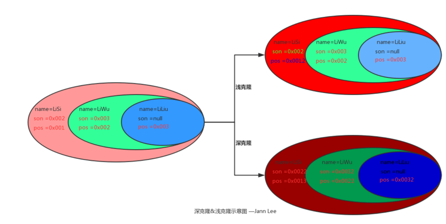

# 创建型模式 
创建型模式关注对象的创建过程，是一类最常用的设计模式。
该模式对类的实例化过程进行了抽象，将对象的创建与对象的使用分离。

## 简单工厂
仅仅传递参数，决定需要哪种对象；
很难拓展；

## 工厂模式
不再提供一个工厂类来统一负责对象的创建，而是将对象的创建过程交给专门的工厂子类去完成。
先定义一个工厂模板类，设计为抽象类，再定义具体的工厂类来创建对象。

## 抽象工厂模式
产品族

## 建造者模式
使用相同的构造过程创建不同产品，这类产品一般具有较多的共同点，组成成分相似。

## 原型模式
使用原型实例指定待创建对象的类型，并且通过复制这个原型来创建新的对象。

浅克隆：创建一个新对象，新对象的属性和原来对象完全相同，对于非基本类型属性，仍指向原有属性所指向的对象的内存地址。
深克隆：创建一个新对象，属性中引用的其他对象也会被克隆，不再指向原有对象地址。

Java Object类自带的clone是浅克隆
== 比较对象地址
equals 比较值

## 单例模式
单例类具有一个私有构造函数，一个静态私有本类成员、一个静态public的工厂方法getInstance(),用于返回唯一实例；

